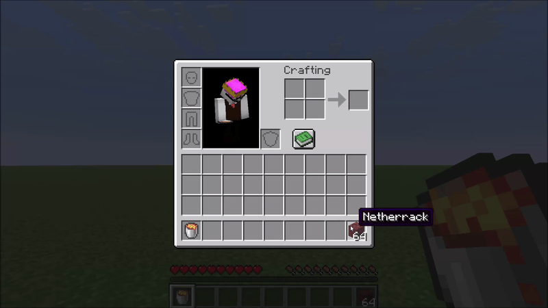
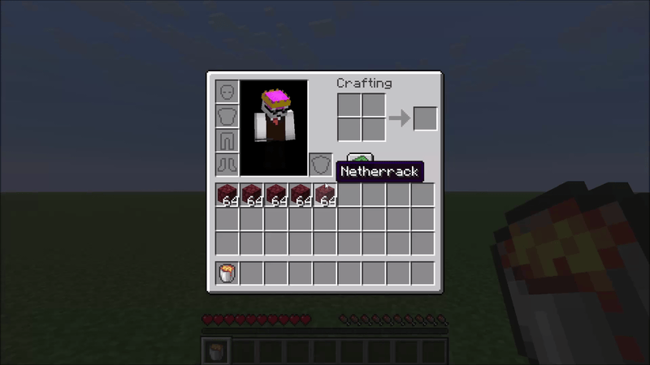
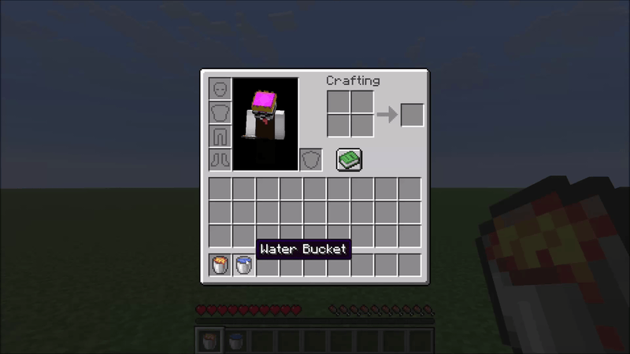

# Lava Can

A small inventory utility mod for Minecraft. A **Lava Bucket** in your hotbar or cursor acts as an instant item destructor — toss unwanted items onto it to burn them away. Fire-resistant items and anything on the configurable exclusion list are always protected from accidental deletion.

---

## How it works

### Right-click to destroy
Carry any item in your cursor, then right-click it onto a **Lava Bucket** in your inventory. The item is destroyed instantly in a burst of flame particles.



### Hotbar shortcut
If your Lava Bucket sits in hotbar slot **N**, pressing **N** while hovering over an item in any inventory screen sends that item straight to the void — no picking it up first.



### Obsidian crafting
Right-click a **Water Bucket** onto a **Lava Bucket** to combine them. Both buckets become empty buckets and you receive one **Obsidian**, marked by a small smoke animation.



---

## Protected items

**Fire-resistant items are never deleted.** The mod uses Minecraft's own damage-resistance system, so Netherite gear, Ancient Debris, and any modded item that opts into fire resistance are all automatically protected — no hardcoded lists.

A **configurable exclusion list** protects additional valuable items from accidental deletion. By default this covers things like Elytra, Tridents, Shulker Boxes, Diamond gear, and other items you generally don't want to lose. See the Configuration section below.

---

## Configuration

The config file is created automatically at `config/lavacan.json` on first launch:

```json
{
  "excluded": [
    "minecraft:elytra",
    "minecraft:trident",
    "minecraft:diamond_sword",
    "..."
  ]
}
```

- **Remove** an entry to allow that item to be deleted by the Lava Can.
- **Add** any `namespace:item_id` to protect a custom or modded item.

Changes take effect after restarting the game (or the world on a dedicated server).

---

## Compatibility

The mod hooks into `AbstractContainerMenu.doClick` via a Mixin — a common and stable injection point. Conflicts with other mods targeting the same method are possible but unlikely in practice.

The mod should be installed on **both client and server**. 

---

## License

MIT — see [LICENSE](LICENSE).
